# pokeapi-pipeline

Extract & Load pipeline pulling four related entities — `pokemon`, `pokemon-species`,
`type`, `move` — from [PokeAPI](https://pokeapi.co) into a single local DuckDB file, organised
as a layered warehouse: an immutable `raw` capture and a typed, validated `staging` layer
derived from it. The Transform step (an `analytics` star schema) is out of scope and delivered
as a [diagram](diagrams/transform-star-schema.png).

## Run

Needs only [`uv`](https://docs.astral.sh/uv/) (it fetches Python 3.13 itself):

```bash
uv sync
uv run pipeline        # creates data/pokemon.duckdb (file + schema) and loads it
```

## Configuration
The run is driven entirely by `config.toml` — no CLI args:

| key             | default                | meaning                                             |
|-----------------|------------------------|-----------------------------------------------------|
| `db_path`       | `data/pokemon.duckdb`  | output file                                         |
| `limit`         | `151`                  | pokemon to pull (Gen 1); species/moves/types follow |
| `user_agent`    | `pokeapi-pipeline/0.1` | required (the default UA is 403'd)                  |
| `request_delay` | `0.1`                  | throttle between calls (seconds)                    |
| `stages`        | `["extract", "load"]`  | drop `extract` to re-load from cached `raw`         |

A full Gen-1 run is ~900 requests (a couple of minutes at the default throttle); lower `limit` for a
quick check. A refresh is just deleting the file. Inspect with any DuckDB client:
`duckdb data/pokemon.duckdb`.

## Architecture

Hexagonal (ports & adapters) with modules, see the [architecture diagram](diagrams/architecture.svg) for reference.



```
src/pokeapi_pipeline/
  config.py              # Config + load_config()
  core/
    domain/              # models · records · mapping   (pure, no I/O)
    application/         # ports · pipeline (Stage, ExtractStage, LoadStage)
  adapters/
    source.py            # PokeApiSource  (httpx + hishel)
    storage.py           # DuckDbStorage  (raw + staging)
    schema.sql           # warehouse DDL
    cli.py               # CLIPipelineRunner — entry point + wiring
```

## Approach

The pipeline rests on two foundations — **clean modular architecture** and a **layered
data warehouse** — chosen so the system stays legible to both humans and AI tooling.

The code follows hexagonal/ports and adapters architecture: a core (domain + application) that depends on nothing
infrastructural, with adapters (PokeAPI over httpx, DuckDB) implementing the ports it declares.

The data follows the medallion idea — three layers, each rebuilt from the one before it:

- **`raw`** — immutable capture of the API payloads; doubles as the cache and the resume checkpoint.
- **`staging`** — a typed, validated projection derived from `raw`.
- **`analytics`** — the deferred star schema (the diagram) that would serve business consumers.

Because `raw` is immutable, a parsing change re-runs Load with zero API calls, and there are no
migrations — every layer is rebuildable from the one before.

Development was spec-driven with [OpenSpec](https://github.com/Fission-AI/openspec): the
requirements were captured up front as a change (`proposal.md` → `design.md` → `tasks.md`),
built inner-to-outer one task at a time, and each task validated with unit tests before moving
on. This keeps an AI-assisted workflow honest: the design is the source of truth, the task
list is the contract, and the tests prove the contract is met. Professional tooling throughout:
`uv` (deps/lock), `mise` (toolchain + tasks), `ruff` (lint + format), `mypy`, `pytest`.

Full rationale and trade-offs: `openspec/changes/extract-load-pokeapi/design.md`.

## Testing

```bash
uv run pytest          # or: mise run test
```

Each module is tested against fixtures recorded from real PokeAPI responses and replayed
in-process, so the suite never touches the network and runs on an in-memory DuckDB.

## Development

[`mise`](https://mise.jdx.dev/) provisions the toolchain (Python + uv) and wraps the dev tasks —
none are required to *run* the pipeline:

- `mise run fmt` — format (`ruff format`)
- `mise run lint` — lint + type-check (`ruff check` + `mypy`)
- `mise run test` — tests (`pytest`)
- `mise run check` — full gate: format-check, lint, type-check, test
